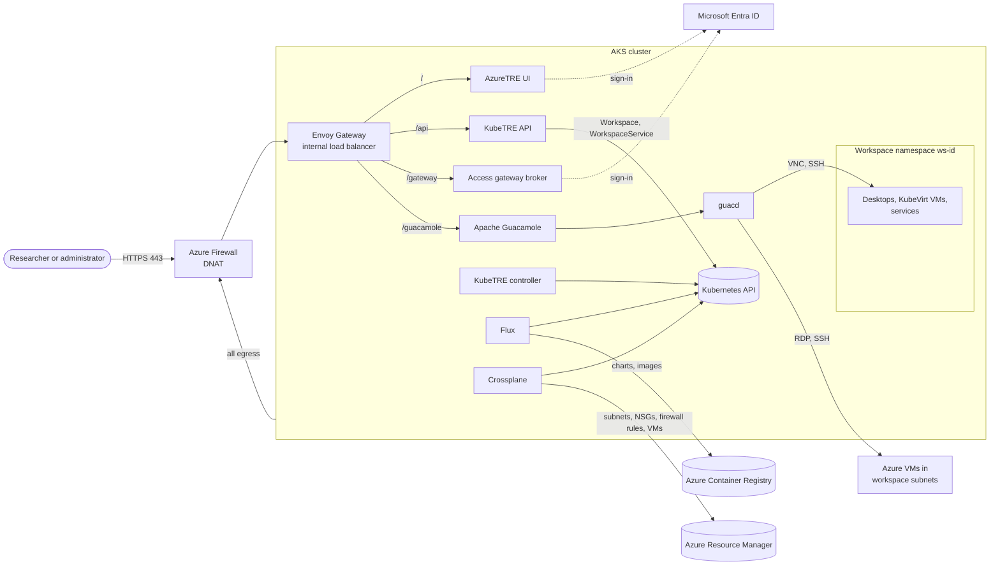
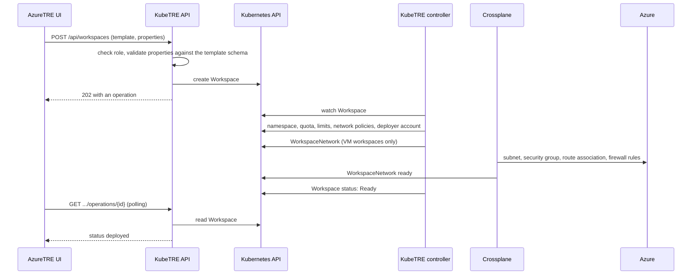
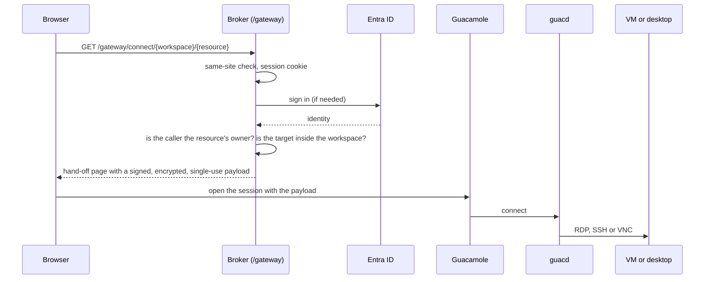

# Architecture

KubeTRE keeps AzureTRE's concepts and user experience, and replaces how they are built. The
biggest change is the composition service: AzureTRE's API, Cosmos DB, Service Bus, resource
processor and Porter are replaced by Kubernetes resources, a controller and GitOps.

## Overview

Everything runs on one AKS cluster with three node pools, plus an optional fourth:

| Node pool | Runs |
|---|---|
| `system` | AKS add-ons and KubeVirt's control components |
| `work` | Flux, Crossplane, Envoy Gateway, CDI, the KubeTRE controller and API, and workspace containers |
| `gateway` | the access gateway only (tainted); its pods use a dedicated subnet that VM security groups trust |
| `kubevirt` | KubeVirt VMs only (tainted, optional) |

## Components

| AzureTRE | KubeTRE | Notes |
|---|---|---|
| TRE API (FastAPI on App Service) | KubeTRE API (Go), `internal/tre` and `internal/api` | Serves AzureTRE's REST API at `/api`, and KubeTRE's own at `/api/v1` |
| Configuration store (Cosmos DB) | Kubernetes API (etcd) | Workspaces and services are custom resources |
| Service Bus | none | The API writes desired state; the controller watches it |
| Resource processor (Python on a VM scale set) and Porter | KubeTRE controller, Flux, Crossplane | See [Provisioning](#provisioning-a-workspace) |
| Porter bundle | Helm chart and template resource | Charts are OCI artifacts in ACR |
| Application Gateway | Azure Firewall DNAT and Envoy Gateway | One public entry point, port 443 |
| Guacamole App Service per workspace | One shared access gateway | OIDC broker, Guacamole and guacd |
| Azure Bastion and jump box | none | Operators use `kubectl` through Entra ID |
| UI (React) | the same UI, vendored | Runtime configuration and workspace roles from the API |

The custom resources are:

| Resource | Scope | Meaning |
|---|---|---|
| `WorkspaceTemplate` | cluster | a kind of workspace: quota, egress, Pod Security, VM network, form schema |
| `ServiceTemplate` | cluster | a kind of workspace service or user resource: chart, values, form schema |
| `Workspace` | cluster | one workspace: template, parameters, members, allowed domains |
| `WorkspaceService` | workspace namespace | one workspace service, or with a parent, one user resource |
| `WorkspaceNetwork`, `ResearchVM` | workspace namespace | Crossplane composite resources for the VM subnet and Azure VMs |

## Provisioning a workspace

AzureTRE sends a message through Service Bus to a resource processor, which runs a Porter
bundle and reports back through another queue. KubeTRE has no queue: the API records what is
wanted, and the controller makes it so.

Workspace services and user resources follow the same pattern. The controller creates a
Flux `OCIRepository` and `HelmRelease` in the workspace namespace. Flux installs the chart
while impersonating the workspace's `kubetre-deployer` account, which can create workloads,
VMs and disks in that namespace only. A chart cannot change the workspace's network policies,
quota or RBAC.

Properties of this design:

- **Desired state is the store.** There is no separate database to fall out of step.
- **Retries are built in.** Controllers reconcile until the actual state matches.
- **Concurrency is safe.** The API passes the resource version as AzureTRE's `_etag`, so
  conflicting updates fail cleanly.
- **Operations are derived.** The API reports an operation's status from the resource's
  generation and phase, so there is no operation history after a resource is deleted.

## The access gateway

The broker decides every connection from current data. See
[ADR 9](../adr/0009-access-gateway.md) for the full design.

## Further reading

- [Networking](networking.md) and [Azure resources](azure-resources.md).
- Architecture decisions: [ADR 1](../adr/0001-operator-model.md) (operator model),
  [ADR 4](../adr/0004-egress.md) (egress), [ADR 8](../adr/0008-vm-security-model.md) (VMs),
  [ADR 10](../adr/0010-azuretre-ui.md) (the AzureTRE UI).
