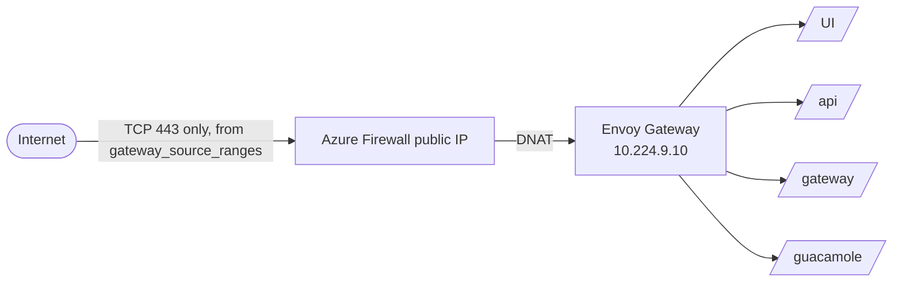

# Networking

AzureTRE uses a hub-and-spoke design: a core VNet and one peered VNet per workspace. KubeTRE
uses one VNet for the cluster, isolates workspaces inside it with Kubernetes network policies,
and gives each VM workspace its own subnet with its own security group.

## Address plan

With the default `vnet_address_space` of `10.224.0.0/16`:

| Subnet | Range | Holds |
|---|---|---|
| nodes | 10.224.0.0/22 | AKS nodes |
| pods | 10.224.4.0/22 | pods on the system, work and KubeVirt pools |
| gateway pods | 10.224.8.0/24 | pods on the gateway pool only; the one source VM security groups admit |
| shared internal load balancers | 10.224.9.0/24 | Envoy Gateway's internal load balancer at 10.224.9.10 |
| AzureFirewallSubnet | 10.224.10.0/26 | Azure Firewall |
| private endpoints | 10.224.11.0/24 | the registry's private endpoint |
| workspace VM subnets | 10.240.0.0/16 (`vm_address_pool`) | one /26 per VM workspace, created on demand |
| Kubernetes services | 172.16.0.0/16 (`service_cidr`) | cluster-internal only |

## Ingress



The firewall's DNAT rule on port 443 is the only way in. TLS is terminated at Envoy Gateway
with the certificate in the `kubetre-gateway-tls` secret. The AKS API server and the registry
accept only `operator_ip_ranges`. There is no Application Gateway and no Bastion.

## Egress

Every subnet routes `0.0.0.0/0` to Azure Firewall, and the cluster uses user-defined routing,
so nothing reaches the internet except through the firewall. Rules are layered:

| Rule collection group | Priority | Contains |
|---|---|---|
| `rcg-platform` | 200 | the inbound DNAT rule; AKS tunnel ports; Windows activation (KMS) for VM subnets; the `AzureKubernetesService` FQDN tag; the sign-in provider and `platform_egress_fqdns` |
| `rcg-cluster-api` | 300 | pods to the AKS API server's address; AKS extensions and Azure Monitor endpoints; managed-disk endpoints, from the node subnet only |
| `rcg-ws-<id>` | 1000 and up | one per VM workspace: HTTPS from its subnet to its allowed domains, and OS updates |

The firewall cannot tell one pod from another, because all pods share the pod subnet. For
pods, isolation comes from Cilium instead:

- **Default deny.** Each workspace namespace denies all traffic in and out by default.
- **Within the workspace.** Pods may talk to each other inside it.
- **DNS.** Allowed to the cluster DNS, through Cilium's DNS proxy.
- **Inbound.** Only from the access gateway's guacd pods.
- **Outbound.** HTTPS only to the workspace's allowed domains, enforced by a
  `CiliumNetworkPolicy` with FQDN rules. If Cilium's FQDN filtering is unavailable, the
  workspace has no internet access at all.

## Workspace VM subnets

For workspaces with virtual machines, Crossplane creates a subnet and a network security group:

| Direction | Rule | Allows |
|---|---|---|
| Inbound | `allow-same-subnet-in` | within the subnet |
| Inbound | `allow-access-gateway-in` | SSH and RDP from the gateway pod subnet only |
| Inbound | `deny-all-in` | nothing else |
| Outbound | `allow-same-subnet-out` | within the subnet |
| Outbound | `allow-shared-services-out` | HTTP and HTTPS to the shared services subnet |
| Outbound | `allow-internet-https-out` | HTTPS, which the route sends through the firewall |
| Outbound | `allow-windows-activation-out` | TCP 1688 for Windows licensing |
| Outbound | `deny-virtual-network-out` | nothing else in the VNet, including other workspaces |
| Outbound | `deny-all-out` | nothing else |

The firewall then narrows outbound HTTPS to the workspace's allowed domains. In AzureTRE the
equivalent inbound rule admits Azure Bastion; in KubeTRE it admits guacd, which runs only on
the gateway pool.

## Monitoring traffic

AKS control-plane logs and Azure Firewall logs go to the Log Analytics workspace `log-<env>`.
To see what the firewall denied:

```kusto
AZFWApplicationRule
| where TimeGenerated > ago(1h) and Action == "Deny"
| summarize Count = count() by Fqdn, SourceIp
| order by Count desc
```

AzureTRE secures Azure Monitor with a private link scope; KubeTRE does not yet.
